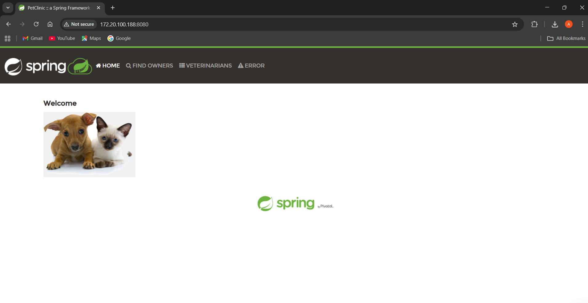

# Spring Petclinic Deployment with Ansible & Docker

This project provides a comprehensive guide and automation scripts for deploying the Spring Petclinic application within a Docker container across multiple virtual machines using Ansible.

## Table of Contents

- [Description](#description)
- [Prerequisites](#prerequisites)
- [Project Structure](#project-structure)
- [Setup Instructions](#setup-instructions)
- [Usage](#usage)
- [Inventory File](#inventory-file)
- [Run Commands](#run-commands)

## Description

The Spring Petclinic is a sample application built with Spring Boot, demonstrating best practices for developing Java applications. This project automates its deployment using Ansible playbooks to install Docker, build the application image, and run the container on target servers.

## Prerequisites

Before proceeding, ensure you have the following:

- Ansible installed on your control machine
- SSH access to target virtual machines
- Target VMs running Ubuntu (or compatible Linux distribution)
- Private SSH key for authentication (default path: `~/.ssh/id_rsa`)

## Project Structure

```
spring-petclinic/
├── Dockerfile
├── spring-petclinic-2.7.0.jar
├── playbook1.yaml          # Ansible playbook to install Docker and build Docker image
├── playbook2.yaml          # Ansible playbook to run Docker container
├── hosts.ini               # Ansible inventory file listing target VMs
└── README.md
```

## Setup Instructions

### Dockerfile

The `Dockerfile` is used to build the Docker image for the Spring Petclinic application:

```dockerfile
# Use official OpenJDK image
FROM openjdk:17-jdk-slim

# Set working directory
WORKDIR /app

# Copy JAR file
COPY spring-petclinic-2.7.0.jar app.jar

# Run the application
ENTRYPOINT ["java", "-jar", "app.jar"]

# Expose port
EXPOSE 8080
```

### Playbook 1: Install Docker (playbook1.yaml)

This playbook installs Docker on the target servers:

```yaml
- name: Install Docker on servers
  hosts: servers
  become: yes
  tasks:
    - name: Install required packages
      apt:
        name:
          - apt-transport-https
          - ca-certificates
          - curl
          - software-properties-common
        state: present
        update_cache: yes

    - name: Add Docker GPG key
      apt_key:
        url: https://download.docker.com/linux/ubuntu/gpg
        state: present

    - name: Add Docker repository
      apt_repository:
        repo: deb https://download.docker.com/linux/ubuntu focal stable
        state: present

    - name: Install Docker
      apt:
        name: docker-ce
        state: latest
        update_cache: yes

    - name: Ensure Docker is running
      service:
        name: docker
        state: started
        enabled: yes
```

### Playbook 2: Run Container (playbook2.yaml)

This playbook builds the Docker image and runs the container:

```yaml
- name: Build Docker image and run container
  hosts: all
  become: yes
  tasks:
    - name: Copy Dockerfile
      copy:
        src: ./Dockerfile
        dest: /home/{{ ansible_user }}/Dockerfile

    - name: Copy Spring Petclinic JAR
      copy:
        src: ./spring-petclinic-2.7.0.jar
        dest: /home/{{ ansible_user }}/spring-petclinic-2.7.0.jar

    - name: Build Docker image for PetClinic
      community.docker.docker_image:
        name: petclinic
        tag: latest
        build:
          path: /home/{{ ansible_user }}
        source: build
        state: present

    - name: Run PetClinic container
      community.docker.docker_container:
        name: petclinic
        image: petclinic:latest
        state: started
        ports:
          - "8080:8080"
```

## Usage

1. Update the `hosts.ini` file with your target VM details.
2. Ensure your SSH private key is correctly configured.
3. Run the playbooks in sequence as described below.

## Inventory File

The `hosts.ini` file contains the list of target servers:

```ini
[servers]
192.168.43.134 ansible_user=ubuntu ansible_ssh_private_key_file=~/.ssh/id_rsa
172.20.100.188 ansible_user=sar7an ansible_ssh_private_key_file=~/.ssh/id_rsa
```

## Run Commands

Execute the following commands from your control machine:

```bash
# Install Docker on target servers
ansible-playbook -i hosts.ini playbook1.yaml --ask-become-pass

# Build image and run container
ansible-playbook -i hosts.ini playbook2.yaml --ask-become-pass
```

After successful execution, the Spring Petclinic application will be accessible on port 8080 of your target servers.


