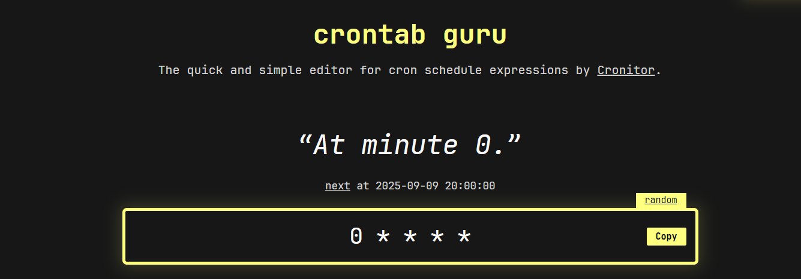
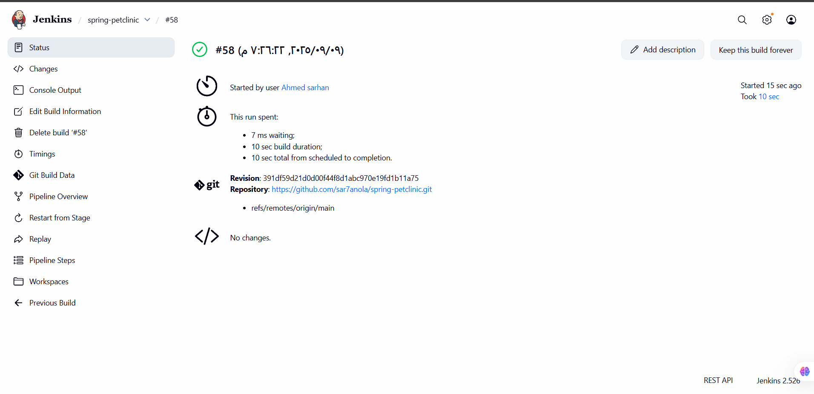
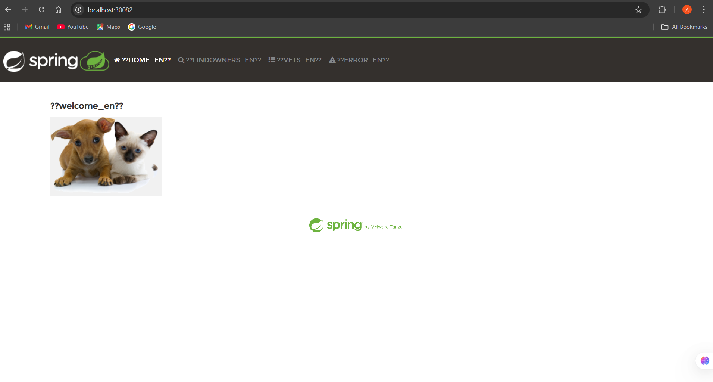
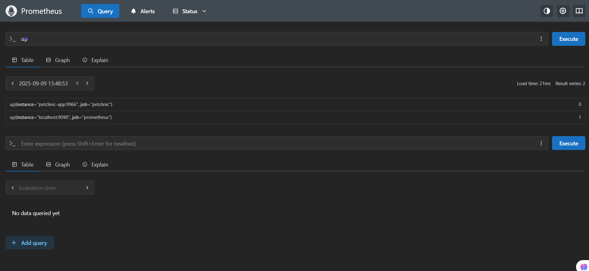

# Petclinic Monitoring & CI/CD Setup

This repository provides a ready-to-use setup for running the **Spring Petclinic App**, **MySQL**, **Prometheus**, **Grafana**, and monitoring using **Docker Compose**, along with a **Jenkins pipeline** for CI/CD.

---

## 🚀 Services Included

* **petclinic-app**: Spring Boot application
* **mysql**: MySQL database
* **prometheus**: Metrics collection
* **grafana**: Dashboards visualization
* **mysqld\_exporter**: MySQL metrics exporter

---

## 📦 Docker Compose

Save the following as `docker-compose.yml`:

```yaml
version: "3.9"

services:
  mysql:
    image: mysql:8.0
    container_name: mysql
    restart: always
    environment:
      MYSQL_ROOT_PASSWORD: root
      MYSQL_DATABASE: petclinic
      MYSQL_USER: petclinic
      MYSQL_PASSWORD: petclinic
    ports:
      - "3306:3306"

  petclinic-app:
    image: springcommunity/spring-petclinic-rest
    container_name: petclinic-app
    restart: always
    ports:
      - "8080:8080"
    depends_on:
      - mysql
    environment:
      SPRING_DATASOURCE_URL: jdbc:mysql://mysql:3306/petclinic
      SPRING_DATASOURCE_USERNAME: petclinic
      SPRING_DATASOURCE_PASSWORD: petclinic

  prometheus:
    image: prom/prometheus
    container_name: prometheus
    volumes:
      - ./prometheus.yml:/etc/prometheus/prometheus.yml
    ports:
      - "9090:9090"

  grafana:
    image: grafana/grafana
    container_name: grafana
    ports:
      - "3000:3000"
    environment:
      - GF_SECURITY_ADMIN_USER=admin
      - GF_SECURITY_ADMIN_PASSWORD=admin

  mysqld-exporter:
    image: prom/mysqld-exporter
    container_name: mysqld-exporter
    environment:
      - DATA_SOURCE_NAME=petclinic:petclinic@(mysql:3306)/
    ports:
      - "9104:9104"
    depends_on:
      - mysql
```

Create a `prometheus.yml` config:

```yaml
global:
  scrape_interval: 15s

scrape_configs:
  - job_name: 'prometheus'
    static_configs:
      - targets: ['prometheus:9090']

  - job_name: 'petclinic-app'
    metrics_path: '/actuator/prometheus'
    static_configs:
      - targets: ['petclinic-app:8080']

  - job_name: 'mysql'
    static_configs:
      - targets: ['mysqld-exporter:9104']
```
Triggers

Set up automated actions that start your build based on specific events, like code changes or scheduled times.



---

---
credintials


---
## ⚙️ Jenkins Pipeline

Save the following as `Jenkinsfile`:

```groovy
pipeline {
    agent any

    environment {
        DOCKER_COMPOSE_FILE = "docker-compose.yml"
        APP_SERVICE = "petclinic-app"
    }

    stages {
        stage('Checkout') {
            steps {
                echo " Cloning repository..."
                git url: 'https://github.com/sar7anola/spring-petclinic.git', branch: 'main'
            }
        }

        stage('Build Docker Images') {
            steps {
                echo " Building Docker images..."
                sh "docker compose -f ${DOCKER_COMPOSE_FILE} build"
            }
        }

        stage('Deploy Services') {
            steps {
                echo " Deploying services..."
                sh "docker compose -f ${DOCKER_COMPOSE_FILE} up -d"
            }
        }
    }

    post {
        always {
            echo " Showing logs..."
            sh "docker compose -f ${DOCKER_COMPOSE_FILE} logs ${APP_SERVICE} || true"
        }
        cleanup {
            echo " Cleaning workspace..."
            cleanWs()
        }
    }
}


---

## ▶️ Run the Project

```bash
docker-compose up -d
```

* Petclinic App → [http://localhost:30082](http://localhost:8080)
* MySQL → `localhost:3306`
* Prometheus → [http://localhost:30090](http://localhost:9090)
* Grafana → [http://localhost:30091](http://localhost:3000) (admin/admin)

---





## 📊 Import Dashboard

* Go to Grafana → **Dashboards → Import**
* Upload the JSON dashboard file you created earlier.

---

✅ Now you have monitoring + CI/CD setup for Petclinic!
